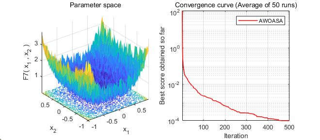

# AWOASA-Magnetic-Target-Positioning
Enhanced WOA with dynamic weight & simulated annealing for high-precision magnetic target localization and geophysical inversion.

This repository contains the official implementation code, benchmark test functions, and real-world magnetic target datasets for the paper **A dual-strategy enhanced metaheuristic for nonlinear geophysical inversion: Application to magnetic target positioning**, submitted to *Computers & Geosciences*.

---

## 1. License
This project is distributed under the **MIT License**. The full license text is available in the `LICENSE` file in this repository.

---

## 2. Dependencies & Computational Requirements
### 2.1 Software Dependencies
- MATLAB R2024a or later
- No additional third-party toolboxes are required (MATLAB built-in functions only)

### 2.2 Minimum Computational Requirements
- CPU: Intel Core i5 12th Gen (12600KF) @ 3.70 GHz or equivalent AMD processor
- RAM: ≥ 16.0 GB
- Operating System: Windows 10/11 or Linux/macOS compatible with MATLAB R2024a

---

## 3. Repository Structure & File Description
This repository is organized into modular, non-compacted files (no `.zip`/`.rar`/`.7z` archives) for full transparency and reusability.

| Folder/File | Description |
|-------------|-------------|
| `/AWOASA` | Core implementation of the proposed AWOASA (Adaptive Weighted Whale Optimization Algorithm with Simulated Annealing) |
| `/AWOASA_and_AWOASA_NoEq13` | AWOASA algorithm with ablation variant (removal of random hunting mechanism) for sensitivity analysis |
| `/AWOASA_dynamic_tracking_detection` | Dynamic moving magnetic target tracking implementation of AWOASA |
| `/WOA` | Standard Whale Optimization Algorithm (baseline for comparison) |
| `/WOA_DW` | WOA with only dynamic weighting strategy (ablation study variant) |
| `/WOA_SA` | WOA with only simulated annealing mechanism (ablation study variant) |
| `/CWOA`, `/LWOA`, `/PSO`, `/GWO`, `/HHO` | State-of-the-art comparison algorithms used in the paper |
| `/Gaussian_White_Noise` | Code for adding Gaussian white noise to simulate real magnetic measurement environments |
| `/Multi-Source_Interference_Mode` | Code for multi-source electromagnetic interference robustness test |
| `/quick-test` | One-click quick test for verifying that the AWOASA code runs correctly |
| `/images` | Images used in this README |
| `Standard Benchmark Functions Dataset.md` | Benchmark function dataset description |
| `Field Magnetic Target Localization Simulation Dataset.md` | Magnetic target dataset description |
| `README.md` | This documentation file |
| `.gitignore` | Git ignore rules for MATLAB temporary files |
| `LICENSE` | MIT License text |

---

## 4. Installation & Basic Usage
### 4.1 Installation
1. Clone this repository:
   ```bash
   git clone https://github.com/maxiangd/AWOASA-Magnetic-Target-Positioning.git
   ```
2. Open MATLAB and set the repository root folder as the current working directory.

### 4.2 Basic Usage
To run the AWOASA algorithm on a custom optimization problem:
1. Define your objective function (fitness function) in a MATLAB `.m` file.
2. Set algorithm parameters (population size, maximum iterations, bounds) in the main script.
3. Run the AWOASA main function/script to obtain the optimal solution.

### 4.3 Quick Test
A minimal example is provided in the `quick-test/` folder to verify that the **AWOASA** implementation runs correctly.

**Steps**
1. Open MATLAB.
2. Set the repository root folder as the current working directory.
3. Run:
   ```matlab
   run('quick-test/main.m')
   ```

**What this quick test does**
- Solves the benchmark function `F7` using AWOASA with:
  - `SearchAgents_no = 30`
  - `Max_iteration = 500`
  - `Run_times = 50`

**Expected output**
- Printed statistics in the MATLAB Command Window:
  - best scores of multiple runs, mean and standard deviation
- A figure with two subplots:
  - benchmark function landscape (2D visualization)
  - convergence curve (average of 50 runs)

**Example output (illustrative)**  
Due to the stochastic nature of AWOASA (random initialization and randomized search operators) and the benchmark function definition, numerical results may vary slightly across runs and machines.  
However, **the overall convergence trend is stable**, and the **final best scores are typically within the same order of magnitude** under the same parameter settings (population size, iterations, bounds, and number of runs).



**Note on randomness / reproducibility**
- This code is stochastic. Results may vary across runs and machines.
- In addition, the benchmark function `F7` (as defined in `Get_Functions_details.m`) includes a random term (`+ rand`), so small run-to-run fluctuations are expected.
- The figure and numbers shown in this repository are **example outputs** for demonstration only.

---

## 5. Reproducing Results in the Paper
### 5.1 Benchmark Function Experiments
1. Navigate to the `/AWOASA` folder.
2. Open `main.m`.
3. Use the parameters reported in the paper (e.g., `N = 30`, `T_max = 500`, 50 independent runs).
4. Run the script. Outputs include statistical results and convergence plots.

### 5.2 Magnetic Target Positioning Experiments
1. Navigate to `/Gaussian_White_Noise` or `/Multi-Source_Interference_Mode`.
2. Open `WOA_main.m` or `AWOASA_main.m`.
3. The scripts load the real-world magnetic target dataset (Harbin field tests) included in this repository.
4. Configure parameters (e.g., `N = 50`, `T_max = 1000`, bounds for 6 target parameters: x/y/z and Mx/My/Mz).
5. Run the script. Outputs include positioning error comparisons and distribution plots.

### 5.3 Ablation Study & Sensitivity Analysis
- Ablation study: run scripts in `/WOA_DW` and `/WOA_SA` with the same benchmark settings.
- Sensitivity analysis: run scripts in `/AWOASA_and_AWOASA_NoEq13`.

---

## 6. User Guide: Inputs / Outputs (Core)
### 6.1 Core Inputs
| Input | Description |
|------|-------------|
| `N` | Population size (number of search agents) |
| `T_max` | Maximum number of iterations |
| `lb` | Lower bound of the search space |
| `ub` | Upper bound of the search space |
| `dim` | Dimension of the problem |
| `fitness` | Objective function handle to be minimized |

### 6.2 Core Outputs
| Output | Description |
|--------|-------------|
| `X_best` | Best solution vector found |
| `fitness_best` | Best objective value found |
| `convergence_curve` | Best objective value per iteration |

---

## 7. Code Specification
- All code is written in MATLAB with English comments.
- No compiled binaries, encrypted files, or compressed archives are included.

---

## 8. Contact
For questions about the code or paper, please contact:
- Author: Xiangdong Ma
- Email: xiangdongma_181@stu.qau.edu.cn
- Affiliation: College of Science and Information, Qingdao Agricultural University, Qingdao, China
